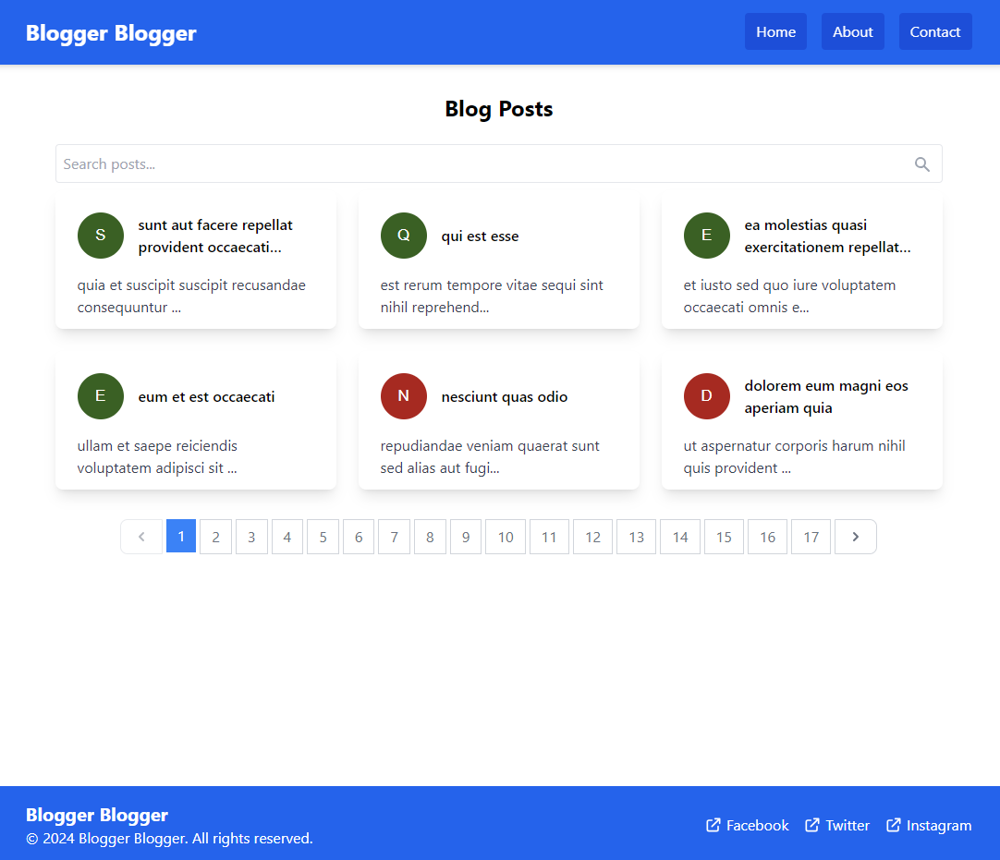

# Blogger Blogger: Blog Post Viewer

This project is a blog post viewer that fetches and displays blog posts from the [JSONPlaceholder API.](https://jsonplaceholder.typicode.com/posts)

## Preview



## Technologies Used

- React
- Tailwind CSS

## Setup and Running the Application

1. Clone the repository:
    ```bash
    git clone https://github.com/lope1999/blog-post-viewer.git
    cd blog-post-viewer
    ```

2. Install dependencies:
    ```bash
    npm install
    ```

3. Start the development server:
    ```bash
    npm start
    ```

4. Open your browser and navigate to `http://localhost:3000`.

## Features

- Display a list of blog post titles.
- Click on a title to view the full content of the selected post.
- Responsive design using Tailwind CSS.
- Error handling and loading states for data fetching.

## Bonus Features

- Pagination for the list of blog posts.
- Adding comments to blog posts and displaying them.
- Implementing search functionality to filter blog posts by keywords.
- Writing unit tests for the code.

## Deployment

The application is deployed on Vercel. You can view it live [here](https://blog-post-viewer.vercel.app/).

## Testing

Unit tests are written using Jest. To run the tests, use the following command:
    ```bash
    npm test
    ```

## License

This project is licensed under the MIT License.
